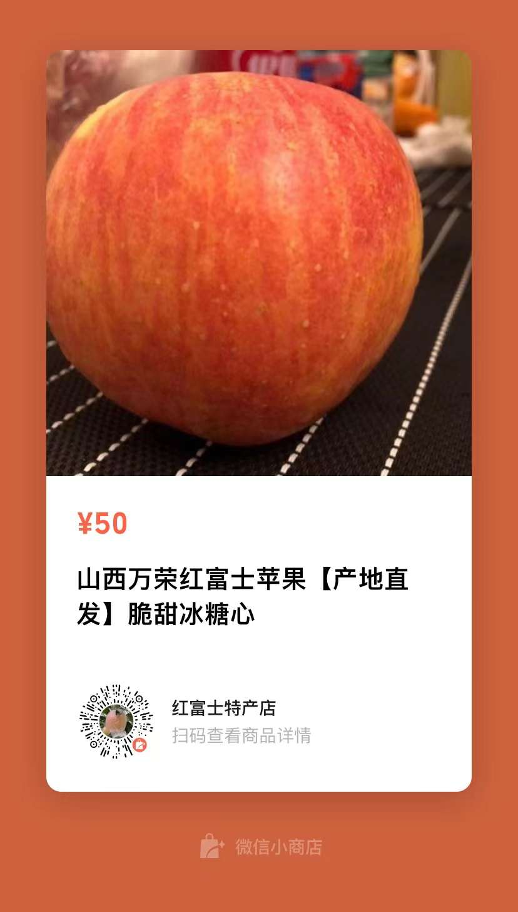

[comment]: <> (![Self Picture]&#40;me.png "Me"&#41;)
[comment]: <> ([我的 GitHub]&#40;https://github.com/chafel&#41;)



一个热情但没有才华的年轻人。 

- 前端开发者，2014 年入行，经历过 BearyChat 和 DiDi，如今在 MT
- 追求效率，喜欢做工具，开发了几个 Chrome 插件：
  - [iRead](https://chrome.google.com/webstore/detail/nelcbbedkpoknladgbpebfflnambeiif)
  - [Rect-selector](https://chrome.google.com/webstore/detail/ofehndagebpfnpdkaihlmaojifhjljpb)
  - [EYE](https://chrome.google.com/webstore/detail/mjjakaamelpccjdmajfhbbiabcofaicm)
- 拥抱开源，贡献过一些技术文章的翻译： 
  - MDN 的 [关键渲染路径](https://developer.mozilla.org/zh-CN/docs/Web/Performance/Critical_rendering_path) 
  - 现代 JavaScript 手册的 [事件循环：微任务和宏任务](https://zh.javascript.info/event-loop)
- 乐于分享，我的 [利器分享](https://slides.com/chaofeisun/deck) 和 [Bookmarklet 分享](https://chafel.github.io/bookmarklets/)
- 摄影爱好者，常用设备是索尼黑卡 5 和 iPhone
- 影视爱好者，观影量 1000+，只为看到好故事，年轻时喜欢热血和动作，如今喜欢隐忍和回忆
- 有一个微信公众号:
- 老家在山西运城，家里种苹果 20+ 年，每年会在朋友同事圈帮家里卖点，不为赚钱只求早卖完父母少操心，你可以从以下地方下单：
  
  | 微店       | 微信小商店         |
  | ------------- |:---------------:| 
  | | |

感兴趣的话您可以从页面下方链接找到我，交个朋友吧！
