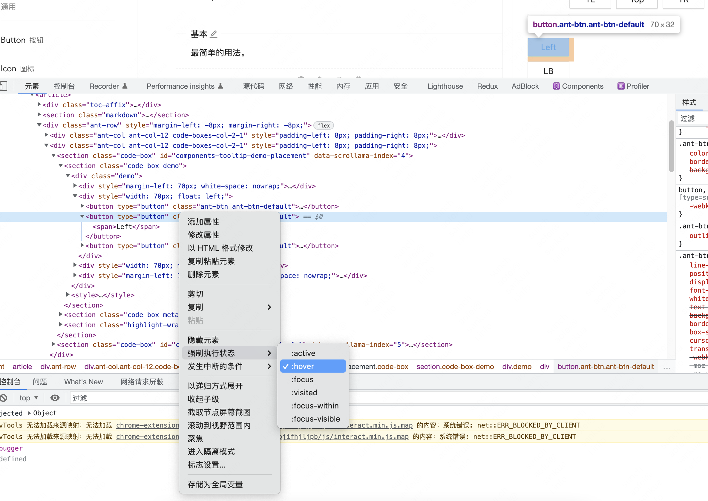
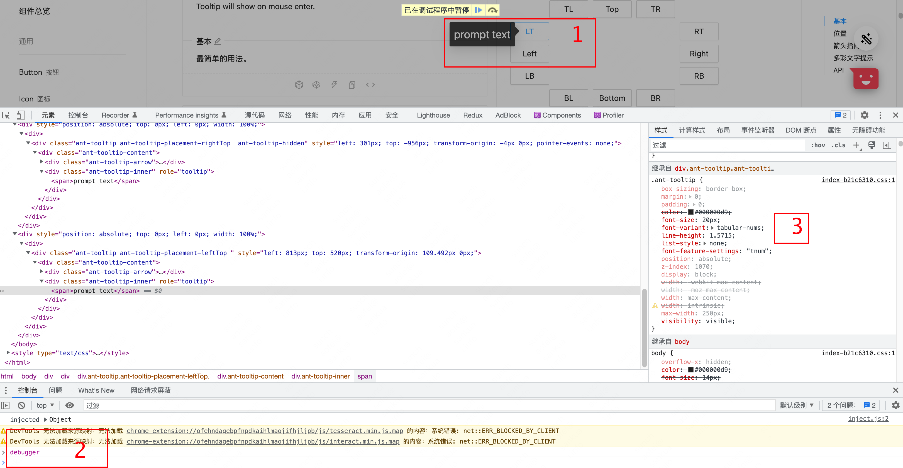
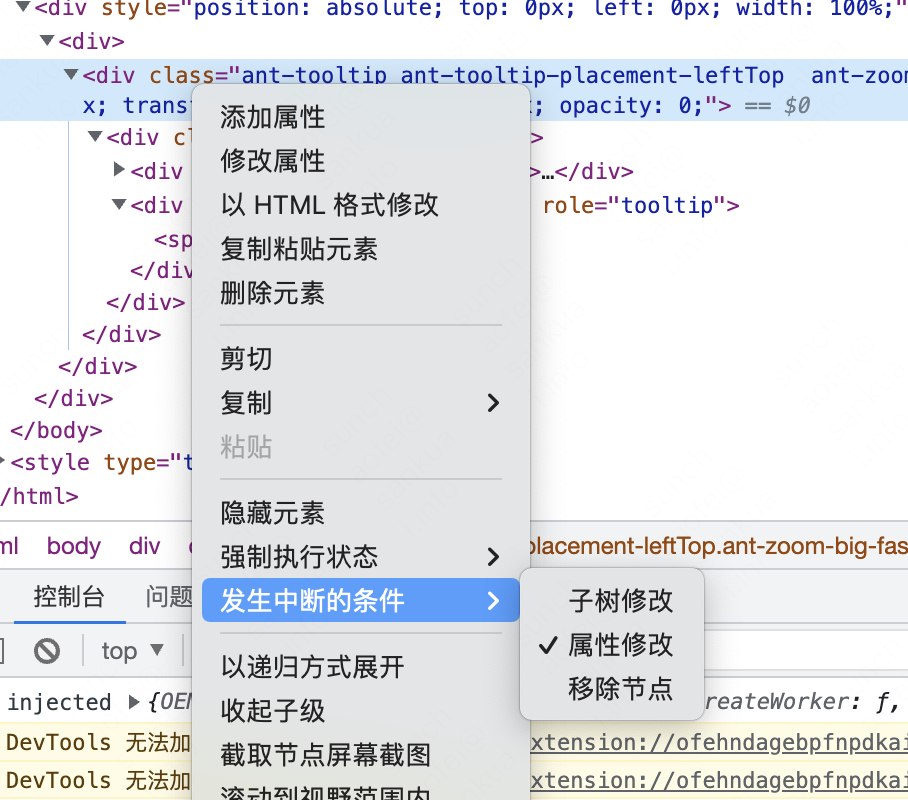
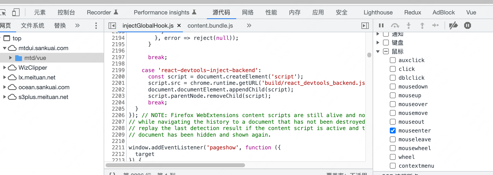

## 场景
前端经常会碰到需要调试 ToolTip、Dropdown 这类事件控制元素显示隐藏的场景，令人抓狂的是调试动态显示的元素时鼠标移到控制台它就消失了😮‍💨

## 方法

### 方法0
开发时在代码里 visible='true' 让这个元素一直展示就可以了。但今天我们探讨的是在包括线上的场景下，都想所见即所得地去调试。

### 方法1

因为鼠标离开后元素就隐藏了，那我们只要重新触发 mouseover 事件即可：
```
$0.dispatchEvent(
    new MouseEvent('mouseover', {
        view: window,
        bubbles: true,
        cancelable: true,
    })
);
```
Chrome 提供了这个操作的快捷方式：



### 方法2
利用 JavaScript 单线程特性：


### 方法3
添加全局事件监听方便断点触发：
```
handler = (e) => {
    if (e.key === 'Enter') debugger;
};
document.addEventListener('keydown', handler);
```
这样在 hover 之后按回车键即可。

### 方法4
理论上可以利用 Chrome 监听 DOM 改动加断点的方法，但这个方法不具备操作性：

还有事件监听器断点：

1. 打开控制台后在 sources 标签下有个 EventListener Breakpoint，在里面找到 mouse 下对应的事件，比如 mouseenter 打勾；
2. 在页面去触发该事件，有可能会有别的事件同时触发，不是自己需要的跳过即可；
3. 当你要的事件触发，就可以尽情调试你要的元素了。


但这两种会受到自身或者别的元素事件干扰，要找到你要调试的元素比较困难，不推荐！

## 总结
推荐简单快捷的方法2和3，为了进一步提高效率，我做了这个 bookmarklet ：[enter keydown to debugger](javascript:(function()%7Bdocument.addEventListener('keydown'%2C%20function(e)%7Bif%20(e.key%20%3D%3D%3D%20'Enter')%20%20debugger%3B%7D)%7D)()) ，拖动👈这个链接到你的浏览器书签栏即可。任何时候想要 debugger 点击一下即可，然后在页面上按回车键即可触发。

更多的常用快捷 bookmarklet 在 https://chafel.github.io/bookmarklets/
