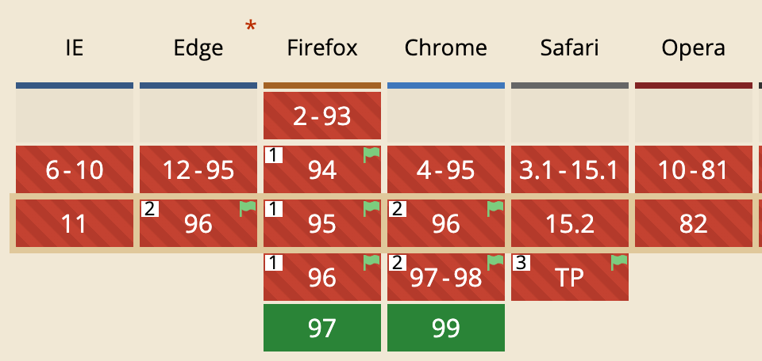
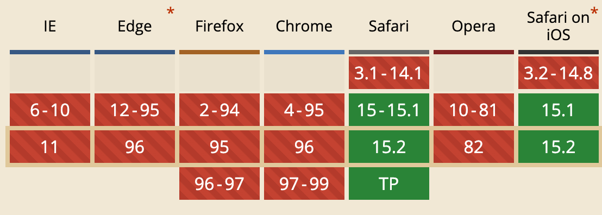
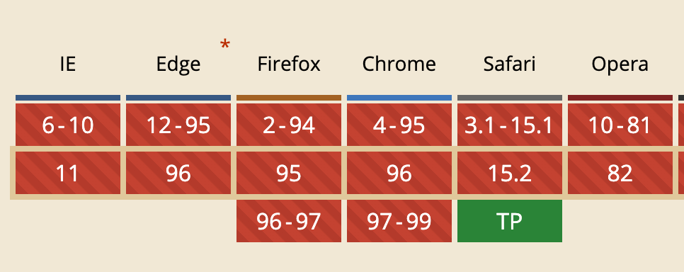

本文整理列出了 [2022 年的 CSS @大漠 @Bramus](https://juejin.cn/post/7048260643589193765) 中我们需要学习的 CSS 新语法，有望在 2022 年在所有浏览器实现:

### Container Queries
CSS 容器查询 @container 有点类似于 CSS 的媒体查询 @media ，只是它将根据元素的父容器（或祖先元素）的尺寸（size）或样式（style）来调整自己或自己后代元素的样式规则。在没有 CSS 容器查询，Web 开发者为了能在不同容器下调整 UI，大多都是依赖于媒体查询来做。也就是说有了该特性之后，不需要再依赖视窗大小加添加类名的方式来调整 UI 了

### Cascade Layers
CSS 新的 @ 规则 @layer 将可以让 CSS 的级联顺序按照你的意图来进行控制。简单地说，@layer 可以通过分层的方式，让你适当控制同源规则的级联排序。

兼容性：

### Color Functions
在 CSS Color Module Level 5 中新增了两个处理颜色的新函数，即:

1. color-mix() 允许你在一个给定的颜色空间中混合两种颜色
2. color-contrast() 在用于构建可访问性 Web 的时候特别有用，对比颜色后取最高对比度颜色

除此之外，还扩展了以前的颜色函数（比如 rgb() 、hsl() 、hwb() 、lab() 和 lch() 等）功能，可以在一个颜色的基础上改变某一个或某几个参数的值，从而得到一个新的颜色。新的色值让颜色更细腻。

### Viewport Units

- svh/svw：小视窗高度（height）、宽度（width）的 1%
- lvh/lvw：大视窗高度（height）、宽度（width）的 1%
- dvh/dwv：动态视窗高度（height）、宽度（width）的 1%

延伸：
- lh 相对于元素自己的 line-height 计算
- rlh 相对于文档根元素（<html> ）的 line-height 计算

### :has()

CSS 的父选择器。不用添加 class，从而简化内容/状态不同的写法。
在特定状态下的展示更容易受到控制，不再依赖类似 classnames 这种工具库结合状态管理来通过加减类名实现样式了👍

### Overscroll Behaviour

控制滚动条行为，避免容器内部和外层同时触发。

### Subgrid

二维布局 Grid 的子网格，解决网格重新划分之后的对齐问题。

延伸：

### Accent Color

各平台上使用风格一致的UI效果

延伸：inputmode

### Media Query Ranges
更清晰明了的声明查询范围

